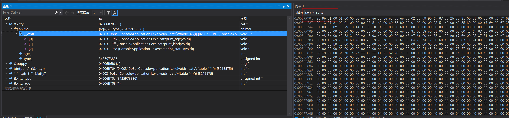
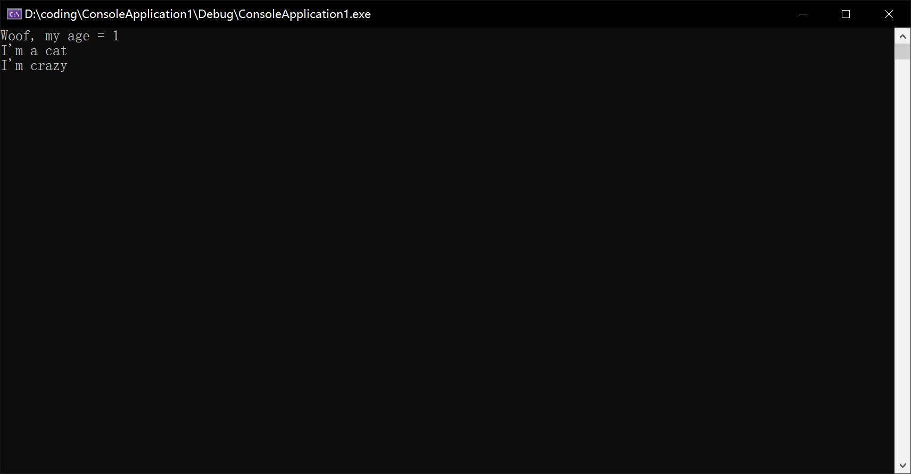
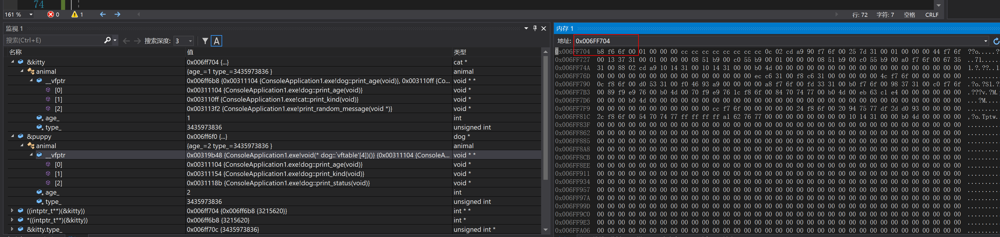
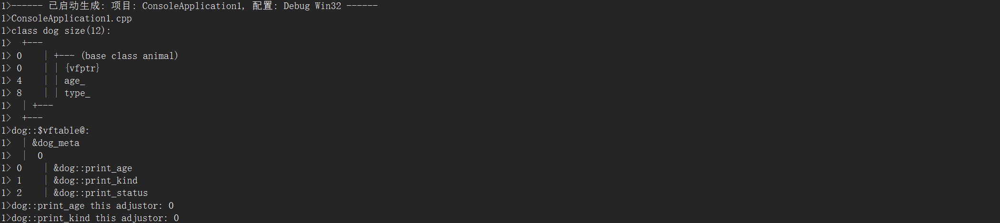

#### 虚类 虚继承

##### 一.虚函数 虚表 虚表指针

一个类中如果有虚函数，类中的实例就有一个指向虚表的指针，存放虚函数的地址

代码来自[RednaxelaFX](http://www.zhihu.com/question/29256578/answer/43725188)

```c++
#include <iostream>
using namespace std;

class animal
{
protected:
    int age_;
    unsigned int type_;
    animal(int age) : age_(age) { }

public:
    virtual void print_age(void) = 0;
    virtual void print_kind() = 0;
    virtual void print_status() = 0;
};

class dog : public animal
{
public:
    dog() : animal(2) { }
    ~dog() { }

    virtual void print_age(void) {
        cout << "Woof, my age = " << age_ << endl;
    }

    virtual void print_kind() {
        cout << "I'm a dog" << endl;
    }

    virtual void print_status() {
        cout << "I'm barking" << endl;
    }
};

class cat : public animal
{
public:
    cat() : animal(1) { }
    ~cat() { }

    virtual void print_age(void) {
        cout << "Meow, my age = " << age_ << endl;
    }

    virtual void print_kind() {
        cout << "I'm a cat" << endl;
    }

    virtual void print_status() {
        cout << "I'm sleeping" << endl;
    }
};

void print_random_message(void* something) {
    cout << "I'm crazy" << endl;
}

int main(void)
{
    cat kitty;
    dog puppy;
    animal* pa = &kitty;

    intptr_t* cat_vptr = (int*)*(int*)(&kitty); /* 64位平台上取值截断 */
    intptr_t* dog_vptr = *((intptr_t**)(&puppy)); /*64 32正常取值 */

    intptr_t fake_vtable[] = {
      dog_vptr[0],         // for dog::print_age
      cat_vptr[1],         // for cat::print_kind
      (intptr_t)print_random_message
    };
    *((intptr_t**)pa) = fake_vtable;

    pa->print_age();    // Woof, my age = 1
    pa->print_kind();   // I'm a cat
    pa->print_status(); // I'm crazy

    return 0;
}
```

上述代码使用vs studio断点查看kitty地址中前32位为虚表指针，内存中为小端储存




fake_vtable存放了三个函数

将kitty的虚表指向此数组，最后打印为如下

类中虚表指针指向虚函数函数的地址，此处将虚表直接替换掉了



此时kitty虚指针如下

虚表指针已经从0x00319b8c 替换为0x006FF704了，其中print_age地址已经变为puppy地址



打印出dog内存布局也同样如下



> 注：C++规范并没有规定虚函数的实现方式。不过大部分C++实现都用虚函数表（vtable）来实现虚函数的分派。