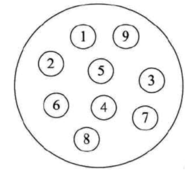
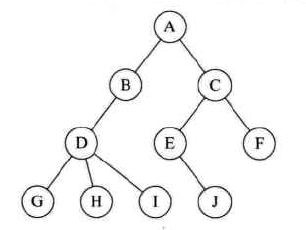
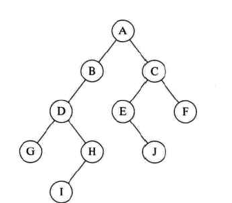

### 数据结构
#### 一.基本概念
程序 = 数据结构 + 算法        

数据：描述客观事物的符号，是计算机中可操作的对象是能够被计算机识别，并输入给计算机处理的符号集合

##### 逻辑结构：
数据对象中数据元素之间的关系
* 集合结构 

* 线性结构

* 树形结构

* 图形结构

##### 物理结构
数据的逻辑结构在计算机中的存储形式
* 顺序存储结构


* 链式存储结构


##### 算法
算法是解决特定问题求解的描述，在计算机中表现为指令的有限序列，并且每一条指令表示一个或多个操作

算法基本特性
* 输入输出 
* 有穷性 
在一个可接受时间范围内
* 确定性
每一个步骤不会有二义性，相同输入一定有同样的输出
* 可行性

#### 二.线性表
零个或多个数据元素的有限序列
##### 顺序表
数组实现，随机存取结构
* 优点
1.不需要为元素之前的逻辑关系（顺序）增加存储空间
2.快速的存取任意一个元素
* 缺点
1.插入删除操作需要移动大量元素
2.线性表长度变化大，不确定时，难以确定存储空间容量
3.造成存储空间碎片
##### 动态链表

* 优点 
1.存储单元可以不连续
2.知道某个位置的指针后插入和删除时间复杂度为O(1)
3.空间不浪费

##### 静态链表
为了给没有指针的语言以数组的方式实现链表。缺点，失去了顺序随机存取的特性。有点，顺序结构插入删除时间复杂度降低

##### 循环链表
解决单链表无法从任意节点访问所有元素
##### 双向链表
每个包含前后节点

#### 三.栈/队列
###### 栈
先进后出 后进先出
应用 
* 四则运算表达式计算
* 逆波兰表达式计算
* 中缀表达式转后缀
* 网页/办公软件撤销回退
* 函数递归/局部变量压栈
###### 队列
先进先出 后进后出

* 顺序队列 
* 循环队列
判断队满方式:1.flag 2.少一位即满 3.增加size计数
* 链式队列

#### 四.字符串
##### 朴素模式匹配
```c++
string s;
string t;
int i = 0, j = 0;
while (i < s.size() && j < t.size()) {
    if (s[i] == t[j]) {
        i++;
        j++;
    } else {
        i = i - j + 2;
        j = 0;
    } 
    if (j >= t.size()) {
        return i - t.size() + 1;
    } 
}
```
##### KMP模式匹配法

思路：

​	下面source 为查找的串，pattern为匹配的串，即在source中寻找pattern出现的位置

​	source: ABABABCDH

​	pattern:ABABCDH

- 在朴素模式的基础上，每次source和pattern的当前字符不相等时，不讲source的查找index回退到最开始。  --可以从已经匹配的字符串得出一些信息

- 如source和pattern已经匹配到如下source 和 pattern index 都为4的时候,可以观察到已经匹配的<font color=red>ABAB</font>中字符的前缀和后缀是有相同的地方可以利用起来的

  source:  <font color=red>ABAB</font><font color = green>A</font>BCDH

  pattern: <font color=red>ABAB</font><font color = green>C</font>DH

- 由于已经匹配部分前后有相等的部分 AB = AB，所以pattern的index可以挪到以下位置来继续进行判断，这样通过已经判断过的字符串就可以得到效率上的提升

  source: <font color=red>ABAB</font><font color = green>A</font>BCDH

  pattern:     <font color=red>AB</font><font color = green>A</font>BCDH

* 但是每当发生不匹配的时候，pattern的index位置该挪到什么位置呢，这就到了kmp算法的核心部分，找到next串，或者可以叫做对pattern串的预先处理（见后文kmp函数）
* 仔细观察ABAB，因为pattern的这一部分和source的这一部分全都匹配上了，我们想尽可能多的利用以匹配的字符串的时候，那么就尽量将source的以匹配字段从后往前看，能使用多少（因为当前source的字符和pattern的不匹配，挪source的index的话时间复杂度就是非线性的了），然后尽量pattern已匹配的字符串尽量往后看能用多少。这个过程那么就是找已配的段落，前缀和后缀相等的部分。

总体思路就是每当发生不匹配的时候就在next串中找到，当前已匹配段落pattern能用多少，然后将pattern的index挪到相应位置去

[leetcode 实现strstr](https://leetcode-cn.com/problems/implement-strstr/)

```c++
vector<int> kmp(string s) {
    vector<int> ret(s.size(), 0);
    int maxLen = 0; /* 可以将maxLen看成pattern从前往后数的index（能够前后缀匹配上的部分） */
    for (int i = 1; i < s.size(); i++) { /* 将i看成source串从后往前数的部分，也代表了当前求的是第几个next字串 */
        /* 每当从前往后和从后往前数的字符不等时，那么就回退前缀已匹配的值与现有的再匹配 */
        while (maxLen > 0 && s[i] != s[maxLen]) {
            maxLen = ret[maxLen - 1];
        }
        /* 当前后当前字符相等，那么前缀匹配上的值就增加 */
        if (s[maxLen] == s[i]) {
            maxLen++;
        }
        /* 当前next串的值就等于已匹配的前缀值 */
        ret[i] = maxLen;
    }
    return ret;
}
int strStr(string haystack, string needle) {
    if (haystack.size() == 0 && needle.size() == 0 || needle.size() == 0) {
        return 0;
    }
    if (haystack.size() < needle.size()) {
        return -1;
    }
    vector<int> maxPre = kmp(needle);
    int count = 0;
    for (int i = 0; i < haystack.size(); i++) {
        while (count > 0 && haystack[i] != needle[count]) {
            count = maxPre[count - 1];
        }
        if (haystack[i] == needle[count]) {
            count ++;
        }
        if (count == needle.size()) {
            return i - needle.size() + 1;
        }
    }
    return -1;
}
```

#### 五.树

##### 定义

一对多的数据结构



- 节点分为 根节点/内部节点/叶子节点
- 节点拥有的子节点的个数为节点的度
- 树的度为各节点度的最大值
- 树的最大层次称为树的深度

##### 二叉树

每个节点只包含0-2个子节点的树



特殊的二叉树

* 斜树 全部只有一边节点

* 满二叉树： 除了叶子节点所有的节点都有两个子节点

* 完全二叉树: i - n的节点在同样深度的满二叉树中位置完全一致就可以叫做完全二叉树

  完全二叉树可以用来实现堆排序: 子节点的编号=（父节点的编号*2 + 1/2）


#### 二叉树的遍历

```c++
class BinaryTree {
public:
	int val;
	BinaryTree* left;
	BinaryTree* right;
};
/*
 * @breif: 前序遍历
 */
void preorderTraversal(BinaryTree* root) {
    if (root == nullptr) {
        return;
    }
    cout << root->val;
    preorderTraversal(root->left);
    preorderTraversal(root->right);
}
/*
 * @breif: 中序遍历
 */
void inorderTraversal(BinaryTree* root) {
    if (root == nullptr) {
        return;
    }
    preorderTraversal(root->left);
    cout << root->val;
    preorderTraversal(root->right);
}
/*
 * @breif: 后序遍历
 */
void postorderTraversal(BinaryTree* root) {
    if (root == nullptr) {
        return;
    }
    preorderTraversal(root->left);
    preorderTraversal(root->right);
    cout << root->val;
}
```

##### 赫夫曼树

树的一个节点到另一个节点之间的路径叫做路径长度。树的路径长度为根节点到每一个节点的路径长度之和

如果路径带权值的话那就是到每个节点的权值*路径 之和最小的二叉树叫做赫夫曼树

如果建立赫夫曼树

1.按权值从小到大排序所有节点

2.将前两个节点弹出来，新建一个节点将前两个小的作为左节点，大的作为右节点

3.然后将当前节点放入当前剩余节点中的有序序列中(当前节点权值为其左右节点权值之和)

4.重复2-3

##### 赫夫曼树应用

压缩编码